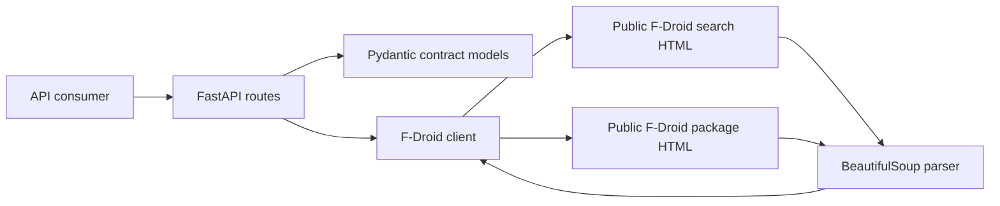

# F-Droid Catalog Adapter

## Project Overview

This project exposes a small, stable JSON API over the publicly visible F-Droid catalog. It turns F-Droid's HTML search and package pages into predictable endpoints for applications that need to find open-source Android apps and inspect their public catalog metadata.

The adapter is intentionally read-only. It does not log in, access user data, download APKs, or call private/internal endpoints.

## Quick Start

### Windows PowerShell

From the repository root:

```powershell
python -m venv .venv
.\.venv\Scripts\Activate.ps1
python -m pip install --upgrade pip
pip install -r requirements.txt
uvicorn app.main:app --reload
```

The API will be available at `http://localhost:8000`.

Verify it from another PowerShell window:

```powershell
Invoke-RestMethod http://localhost:8000/health
Invoke-RestMethod "http://localhost:8000/search?query=notes" | ConvertTo-Json -Depth 5
Invoke-RestMethod "http://localhost:8000/items/org.fdroid.fdroid" | ConvertTo-Json -Depth 5
```

Open interactive API documentation at [`http://localhost:8000/docs`](http://localhost:8000/docs).

### macOS/Linux

```bash
python3 -m venv .venv
source .venv/bin/activate
python -m pip install --upgrade pip
pip install -r requirements.txt
uvicorn app.main:app --reload
```

Verify it with:

```bash
curl http://localhost:8000/health
curl "http://localhost:8000/search?query=notes"
curl http://localhost:8000/items/org.fdroid.fdroid
```

### Docker

```bash
docker build -t fdroid-catalog-adapter .
docker run --rm -p 8000:8000 fdroid-catalog-adapter
```

Then open [`http://localhost:8000/docs`](http://localhost:8000/docs) or run the health check above.

### Run the tests

```bash
python -m pytest -q
```

Expected result:

```text
13 passed
```

### What this project is—and is not

F-Droid is the upstream website. This repository contains our API, not an official F-Droid API. The application makes carefully bounded requests to public F-Droid HTML pages and converts the returned page content into our own JSON contract.

The project is not:

- A replacement for an official F-Droid integration.
- A bulk scraper or catalog mirror.
- A browser automation tool.
- A service that downloads APK files.
- A service that accesses private accounts or user-specific information.

## Why This Website

F-Droid was selected because its catalog is publicly browsable and useful, while the website does not present a public developer API for the search and package-page experience used here. The implementation reads only:

1. The public search page at `https://search.f-droid.org/?lang=en&q=<query>`.
2. The public package page at `https://f-droid.org/en/packages/<package-id>/`.

The observed HTML exposes app names, package IDs, summaries, licenses, descriptions, authors, latest versions, and public source-tarball links. No authentication, CAPTCHA, Cloudflare challenge, paywall, robots exclusion, or other access control is bypassed. Requests use a descriptive user-agent, finite timeouts, and one upstream request per API operation.

The main F-Droid `robots.txt` currently leaves the general `User-agent: *` path open, while separately disallowing a number of named AI crawlers. This project is a small catalog adapter for a hiring exercise, not a bulk crawler or model-training collector. The target policy and terms should be rechecked before any production deployment.

F-Droid search and package pages are website interfaces, not a stable developer API. That distinction is why this project treats the HTML parser as an isolated boundary and documents the resulting reliability limitations.

### Why this is a good hiring-assignment target

This target demonstrates the engineering work the assignment is asking for without requiring unsafe techniques. There is a clear public workflow, useful structured data, predictable failure modes, and a real reason to put an adapter in front of the website: callers should not have to understand F-Droid's HTML layout.

The choice is also intentionally conservative. The implementation makes only one search request or one item request per API call, uses a finite timeout, identifies itself with a user-agent, and does not attempt to work around any access control.

## Reverse Engineering Approach

The public pages were inspected manually and with low-volume GET requests. The relevant structures were:

- Search results: `a.package-header`, `.package-name`, `.package-summary`, and `.package-license`.
- Package pages: `.package-name`, `.package-summary`, `.package-description`, `li.package-link#author`, `li.package-link#license`, and `.package-version#latest`.

### Step-by-step reverse-engineering process

1. **Choose a public workflow.** I selected the smallest useful workflow: search for an app, then open one public package page.
2. **Inspect the public search URL.** A normal GET request to `https://search.f-droid.org/?lang=en&q=notes` returned an HTML search page.
3. **Find the result-card boundary.** Each result was wrapped by `a.package-header`, which also contained the link to the package page.
4. **Find the result fields.** Within each card, `.package-name`, `.package-summary`, and `.package-license` contained the fields needed for a search response.
5. **Inspect a public detail page.** A request to `https://f-droid.org/en/packages/org.fdroid.fdroid/` returned the package detail page.
6. **Find detail fields.** The page exposed `.package-description`, `#author`, `#license`, and the `#latest` version block.
7. **Define our own contract.** Instead of returning HTML, I defined Pydantic models for `AppSummary`, `SearchResponse`, and `AppDetail`.
8. **Isolate parsing.** All CSS selectors are kept in `app/parser.py`, so a website layout change does not leak into the route code.
9. **Add failure handling.** Empty pages, missing required HTML, upstream 4xx/5xx responses, network failures, and timeouts are converted into controlled API errors.
10. **Test without live dependency.** Every test uses a mocked HTTP transport. The test suite does not depend on F-Droid being online.

### What was observed in the HTML

The search result structure was equivalent to:

```html
<a class="package-header" href="https://f-droid.org/en/packages/com.example.notes">
  <h4 class="package-name">Example Notes</h4>
  <div class="package-desc">
    <span class="package-summary">A private notes app</span>
    <span class="package-license">MIT</span>
  </div>
</a>
```

The detail page exposed elements equivalent to:

```html
<h3 class="package-name">F-Droid</h3>
<div class="package-summary">The app store that respects freedom and privacy</div>
<div class="package-description">...</div>
<li class="package-link" id="author">...</li>
<li class="package-link" id="license">...</li>
<li class="package-version" id="latest">...</li>
```

The parser maps these public fields into our stable schema:

| Upstream HTML | Our field | Purpose |
|---|---|---|
| `a.package-header[href]` | `url` | Public package page URL |
| Last URL path segment | `item_id` | Package identifier |
| `.package-name` | `name` | Human-readable name |
| `.package-summary` | `summary` | Short description |
| `.package-license` | `license` | License shown in search |
| `.package-description` | `description` | Long public description |
| `li.package-link#author` | `author` | Public author or organization |
| `li.package-link#license` | `license` | Displayed license name |
| `.package-version#latest` | `latest_version` | Latest displayed version |
| `.package-version#latest .package-version-source a` | `source_url` | Public source link |

The adapter maps these fields into its own Pydantic response models. It does not expose raw HTML or upstream error bodies. Package IDs are validated before being placed into the package-page URL, and the parser returns a controlled upstream-malformed error if required structure disappears.

Assumptions:

- The package-page URL remains `/en/packages/<package-id>/`.
- The search page keeps its public query parameter `q`.
- The CSS class names above remain available.
- The first/latest version block marked `#latest` is the desired latest version.

## Architecture



Routes, upstream HTTP behavior, and HTML parsing are separate. The client owns timeouts and upstream failure translation; the routes own validation and the public API contract.

## API Documentation

### `GET /health`

Returns service liveness. It does not call F-Droid.

Example:

```bash
curl http://localhost:8000/health
```

```json
{"status":"ok"}
```

### `GET /search?query=<query>`

Searches the public F-Droid catalog.

- `query`: required, 1-100 characters; whitespace-only values are rejected.

Example:

```bash
curl "http://localhost:8000/search?query=notes"
```

```json
{
  "query": "notes",
  "items": [
    {
      "item_id": "com.example.notes",
      "name": "Example Notes",
      "summary": "A private notes app",
      "license": "MIT",
      "url": "https://f-droid.org/en/packages/com.example.notes"
    }
  ]
}
```

### `GET /items/{item_id}`

Returns public metadata from one F-Droid package page.

- `item_id`: required path parameter; up to 200 characters and limited to letters, digits, `.`, `_`, and `-`.

Example:

```bash
curl http://localhost:8000/items/org.fdroid.fdroid
```

```json
{
  "item_id": "org.fdroid.fdroid",
  "name": "F-Droid",
  "summary": "The app store that respects freedom and privacy",
  "description": "F-Droid is an installable catalogue of libre software apps for Android...",
  "author": "F-Droid",
  "license": "GNU General Public License v3.0 or later",
  "latest_version": "2.0.1",
  "source_url": "https://f-droid.org/repo/org.fdroid.fdroid_2000051_src.tar.gz",
  "url": "https://f-droid.org/en/packages/org.fdroid.fdroid/"
}
```

Error responses use a stable shape:

```json
{"detail":{"code":"item_not_found","message":"The requested item was not found in F-Droid's public catalog."}}
```

Possible status codes are `422` for invalid input, `404` for a missing item, `502` for an upstream HTTP/network/HTML failure, and `504` for an upstream timeout. Raw upstream HTML and error text are never returned.

### Example error responses

Invalid input:

```json
{
  "detail": {
    "code": "validation_error",
    "message": "query must not be blank."
  }
}
```

Missing item:

```json
{
  "detail": {
    "code": "item_not_found",
    "message": "The requested item was not found in F-Droid's public catalog."
  }
}
```

Upstream timeout:

```json
{
  "detail": {
    "code": "upstream_timeout",
    "message": "The public catalog did not respond in time."
  }
}
```

The exact upstream HTML or upstream error body is deliberately not exposed. This protects the API contract from upstream implementation details.

## Running Locally

Python 3.12+ is required.

```bash
python -m venv .venv
# Windows PowerShell
.\.venv\Scripts\Activate.ps1
# macOS/Linux
source .venv/bin/activate
pip install -r requirements.txt
uvicorn app.main:app --reload
```

Optional environment variables:

- `FDROID_SEARCH_URL` (default `https://search.f-droid.org/`)
- `FDROID_ITEM_URL` (default `https://f-droid.org/en/packages`)
- `UPSTREAM_TIMEOUT_SECONDS` (default `10`, range `0 < value <= 60`)
- `UPSTREAM_USER_AGENT`

OpenAPI documentation is available at `http://localhost:8000/docs`.

## How to Check the Running API

### Windows PowerShell

With the server running, open another PowerShell window and run:

Health check:

```powershell
Invoke-RestMethod http://localhost:8000/health
```

Expected output:

```text
status
------
ok
```

Search:

```powershell
Invoke-RestMethod "http://localhost:8000/search?query=notes" | ConvertTo-Json -Depth 5
```

Item lookup:

```powershell
Invoke-RestMethod "http://localhost:8000/items/org.fdroid.fdroid" | ConvertTo-Json -Depth 5
```

Invalid query:

```powershell
Invoke-RestMethod "http://localhost:8000/search?query=   "
```

The invalid query should return HTTP `422` and a `validation_error` response. The Swagger UI at `http://localhost:8000/docs` provides the same checks through a browser interface: select an endpoint, click **Try it out**, enter values, and click **Execute**.

### curl

```bash
curl http://localhost:8000/health
curl "http://localhost:8000/search?query=notes"
curl http://localhost:8000/items/org.fdroid.fdroid
```

### What a reviewer should verify

1. `/health` returns immediately without contacting F-Droid.
2. `/search?query=notes` returns a JSON object with `query` and `items`.
3. `/items/org.fdroid.fdroid` returns public metadata and a version when the upstream page contains one.
4. Invalid input returns `422`, not a server traceback.
5. A missing package returns `404`.
6. The API never returns raw upstream HTML.
7. The test suite passes without requiring a live F-Droid request.

## Testing

```bash
pytest -q
```

The suite mocks all upstream HTTP calls and covers health, successful search, successful item lookup, response shape, invalid input, missing items, upstream 4xx/5xx, timeouts, and malformed HTML.

The test suite is intentionally independent from the live website. The live smoke check is useful for confirming that the current page structure still matches the parser, but it is not part of the automated tests because external websites can be temporarily unavailable.

## Docker

```bash
docker build -t fdroid-catalog-adapter .
docker run --rm -p 8000:8000 fdroid-catalog-adapter
```

## Limitations

- F-Droid does not guarantee the website HTML as an API contract. CSS classes, URL patterns, or page layout may change.
- The adapter uses live public pages, so upstream availability and response time affect API availability.
- No bulk crawling, caching layer, pagination abstraction, or rate limiter is included in this prototype. A production deployment should add bounded caching and per-client rate limiting.
- The implementation does not validate or mirror every catalog field, and it does not expose APK binaries or user-generated/private information.
- Public page content, licenses, and usage expectations can change. Operators must review F-Droid's current robots policy, terms, and project guidance before deployment and keep request volume low.
- Because F-Droid has no official API contract for these pages, an officially supported API, licensed data source, or formal integration agreement is the appropriate long-term production solution.

## Design Decisions

- `httpx.AsyncClient` keeps upstream I/O non-blocking and applies a finite timeout.
- BeautifulSoup is isolated in `app/parser.py`, so upstream HTML changes are localized.
- Pydantic models define the API contract and prevent raw parser dictionaries from becoming an accidental public schema.
- Expected failures are translated into controlled `404`, `502`, `504`, and `422` responses.
- Configuration uses environment variables without credentials or secrets.
- The surface is intentionally small: search, item lookup, and health are meaningful for the catalog use case without introducing a database, queue, or service mesh.

## Interview-Ready Explanation

The short explanation is:

> I selected F-Droid because it has a useful public app catalog that can be accessed without authentication, but the website search and package-page experience is not a stable developer API. I inspected the public HTML, identified the selectors containing app metadata, and built a FastAPI adapter that converts those pages into predictable JSON. The adapter validates inputs, applies timeouts, hides upstream HTML and errors, and keeps parsing isolated so website changes remain localized. All upstream calls are mocked in pytest. For production, I would prefer an official API, licensed data source, or formal integration agreement.

### Why not use a public API from another provider?

The assignment is specifically about reverse-engineering a public website that does not expose the required information through a public developer API. Using an official API would demonstrate API integration, but it would not demonstrate the requested HTML inspection, parser isolation, upstream stability handling, or contract design.

### What would be changed for production?

The first production question would be whether F-Droid offers an officially supported integration mechanism for the exact data needed. If not, I would obtain a licensed data source or formal permission. Only after that approval would I consider productionizing page parsing, with bounded caching, rate limiting, monitoring, parser contract tests, change detection, and an operational fallback.

## Project Tree

```text
.
├── app/
│   ├── __init__.py
│   ├── config.py
│   ├── errors.py
│   ├── main.py
│   ├── models.py
│   ├── parser.py
│   └── upstream.py
├── tests/
│   ├── __init__.py
│   └── test_api.py
├── .dockerignore
├── .gitignore
├── Dockerfile
├── README.md
└── requirements.txt
```

## Hiring Manager Summary

Built a clean FastAPI adapter over F-Droid's public HTML catalog. The implementation reverse-engineers only public search and package pages, separates routes from upstream HTTP and parsing logic, validates identifiers, applies timeouts, translates upstream failures into stable API errors, and includes mocked pytest coverage for the required success and failure modes. The main trade-off is deliberate: this is a reliable prototype around an HTML interface, not a claim that the interface is a supported API. For production, the provider's official API, a licensed dataset, or a formal integration agreement should replace page parsing.
